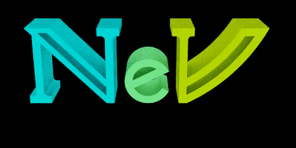
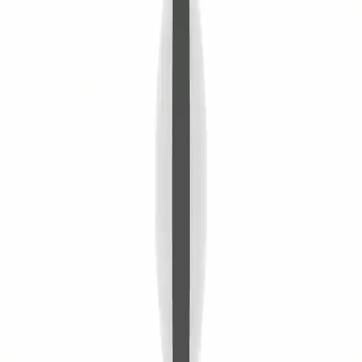

# Ray Tracer

---
### Components

`pytrace` 

`pytrace_core` 

---

### Direct dependencies

`rand` 

`threadpool` 

`glob` 

`ctrlc` 

---

## A Rust library for ray path tracing and image generation

### Contents
- `libtrace` contains most of the path tracing logic.
- `rstrace` is a standalone `.rs` file that gives access to the internal library. It can be used to generate scenes.
- `pytrace` provides an interface with Python, and creates a shared library that can be `import`ed.
- `data` groups a few images usable as sky textures
- `img` is a collection of images that either `rstrace` or `pytrace` are able to generate.
- `misc` contains a cheatsheet on how to properly orient molecule links.

For more informations, refer to the `README` in each subdirectories.

### Side note

An interesting corollary of having access to an accurate dielectic material and being able to create intersections is that I can simulate the behavior of a lens built from the intersection of two dielectric spheres.

Below is an animation that demonstrates how an object seen through a converging lens can be upside down. Remember that the ray tracer has no knowledge of what a lens is, all it does is calculate the path that individual light rays follow.

