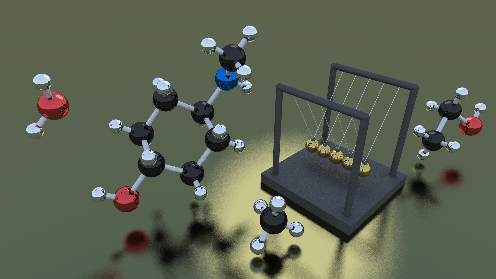
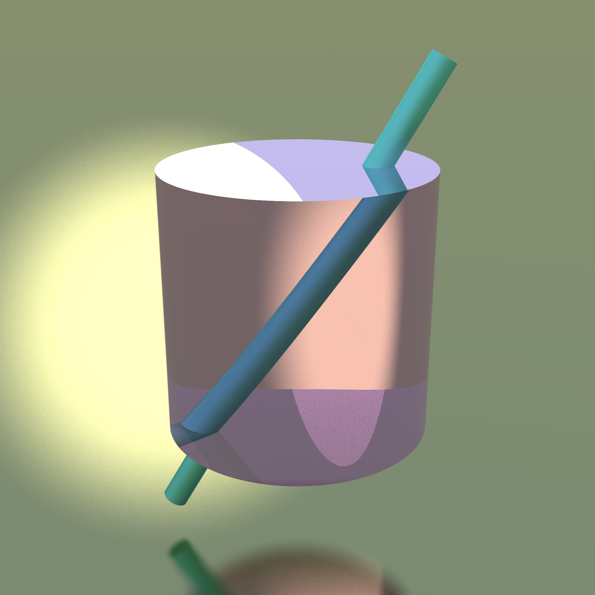
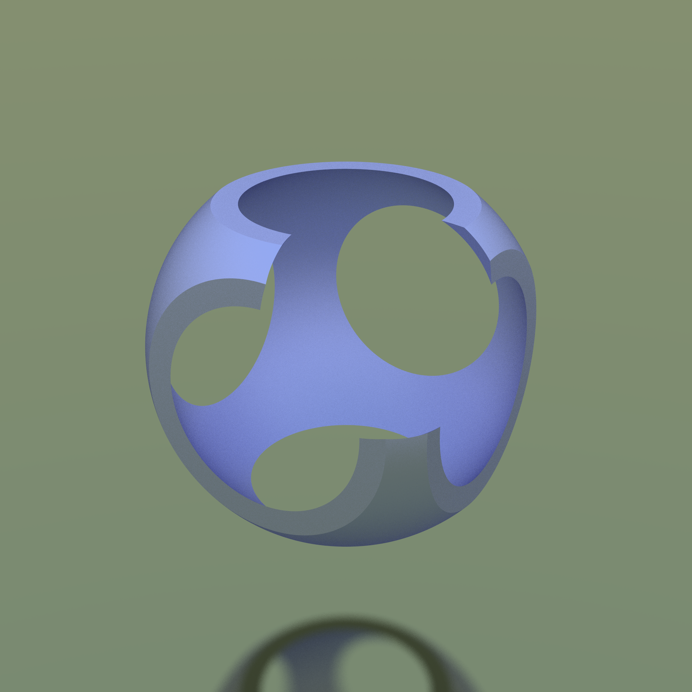
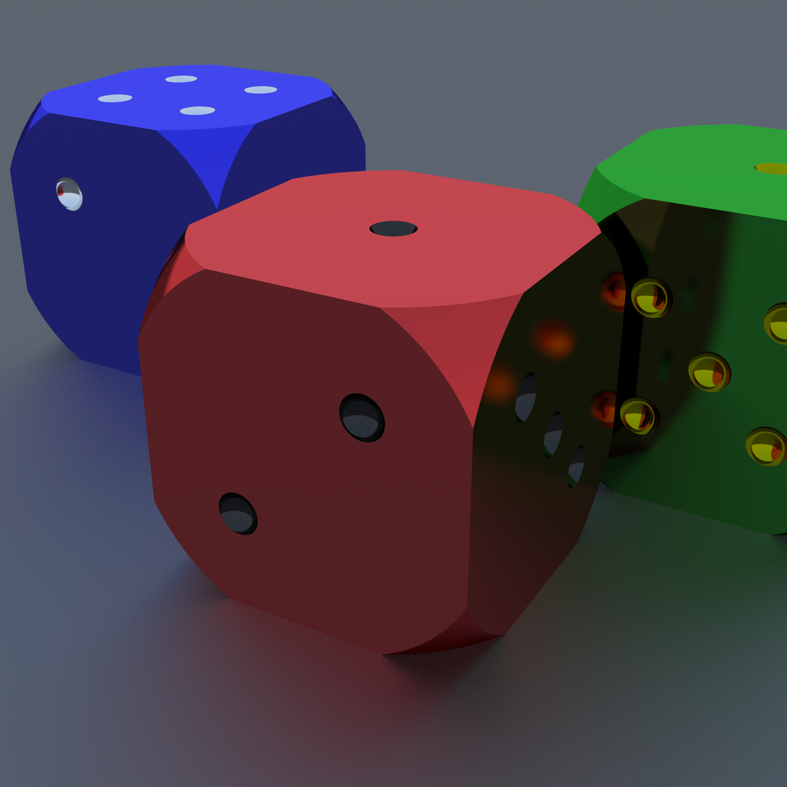

# Preview of some images

The images in this folder are all too wide to fit in the Github image visualizer, so this file will provide an overview without the need for loading large images and scrolling.

  

  
  
  
  
  
  

